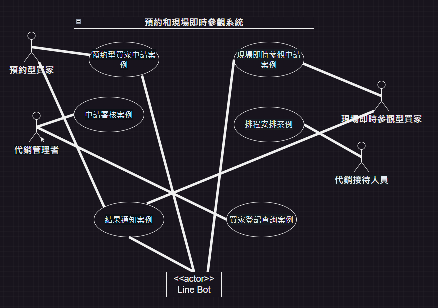
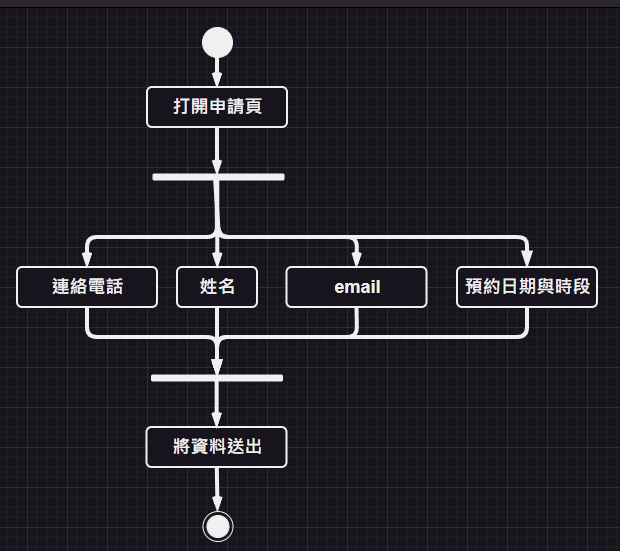
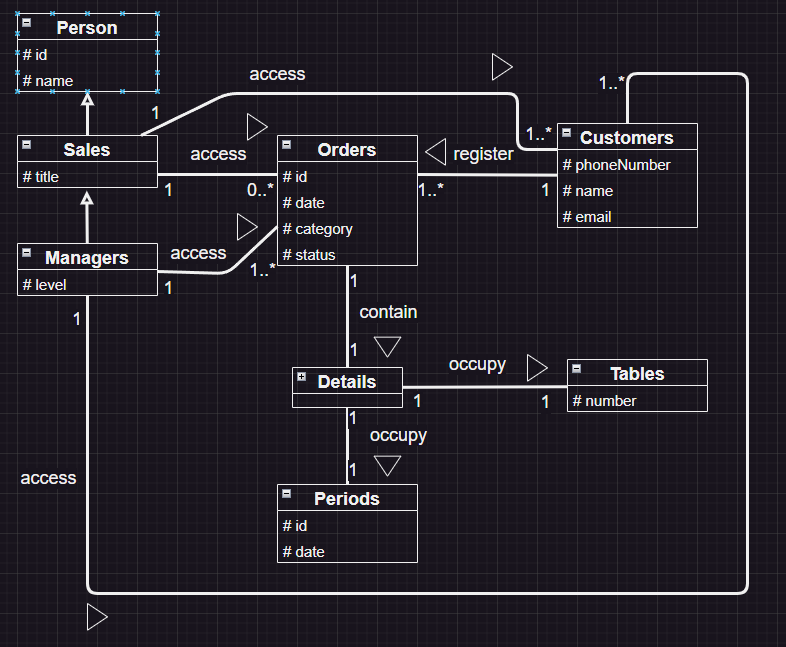
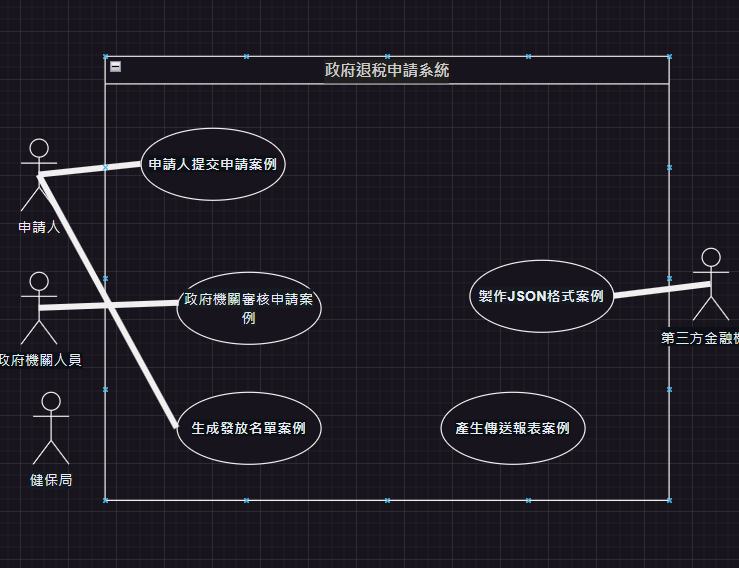
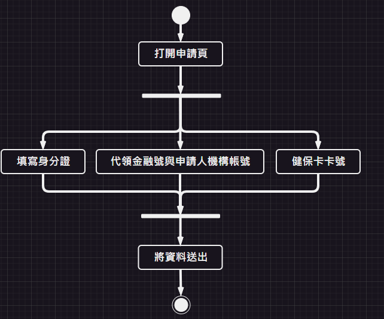
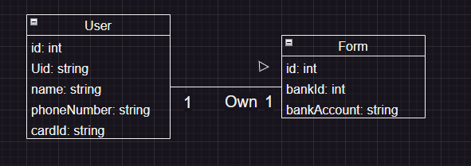

# 期中考-期中-Mid 
<!--(期中標籤註記，該行不能刪，作為驗證標籤，該檔案若沒該份標籤，代表直接貼上saample，直接0分)-->

>
>學號：111111138
> 
>姓名：林奕廷
> 

本份文件包含以下主題：(至少需下面兩項，若是有多者可以自行新增)
- [x] 答題

## 答題

1. 預約和現場即時參觀系統

a.
<u>**利害關係人表**</u>
|利害關係人|目標|
|---|---|
|預約型買家|需要便捷的方式預約參觀房屋並確保預約成功|
|現場即時參觀買家|希望能即時參觀房屋，不需提前預約並能快速安排|
|代銷管理者|審核買家申請，安排買家參觀時段及分配接待人員|
|代銷接待人員|需要知道自己需要接待的買家資訊以便提供服務|
|系統開發者|設計並實施系統，確保系統功能滿足需求並運行良好|

<u>**事件表**</u>
|目標 | 使用案例 |
|---|---|
|預約型買家在到達接待中心前48小時內通過Line bot填寫並提交預約申請|1.預約型買家申請案例|
|現場即時參觀買家在到達接待中心時通過Line bot填寫並提交即時參觀申請|2.現場即時參觀申請案例|
|代銷管理者查看並審核買家的預約或即時參觀申請，並決定是否批准|3.申請審核案例|
|代銷管理者為預約型買家安排參觀時間，或立即為現場即時參觀買家分配接待人員|4.排程安排案例|
|系統通過Line推送通知買家申請的結果 (預約成功/失敗，或即時參觀安排)|5.結果通知案例|
|代銷管理者查看並管理系統中登記的買家資訊|6.買家登記查詢案例|

b.

c.
|||
|---|---|
|使用案例名稱|預約型買家申請|
|描述|預約型買家提交參觀申請。|
|主要參與者|預約型買家|
|利害關係人與目標|預約型買家: 成功預約參觀時間。|
|前置條件|預約型買家已加入Line bot公開頻道。|
|後置條件|預約申請提交並等待審核。|
|主要成功情節|1.預約型買家打開Line bot。 2.選擇“預約制”選單。 3.填寫手機號碼、姓名、期望日期與時段。 4.提交申請。 5.系統確認申請接收。|
|例外情節|申請資料不完整，系統提示重新填寫。|
|其他需求|Line通知和訊息推送功能。|

|||
|---|---|
|使用案例名稱|現場即時參觀申請|
|描述|現場即時參觀買家提交即時參觀申請。|
|主要參與者|現場即時參觀買家|
|利害關係人與目標|現場即時參觀買家: 立即安排參觀。|
|前置條件|現場即時參觀買家已加入Line bot公開頻道。|
|後置條件|即時參觀申請提交並等待分配接待人員。|
|主要成功情節|1.現場即時參觀買家打開Line bot。 2.選擇“現場制”選單。 3.填寫手機號碼和姓名。 4.提交申請。 5.系統確認申請接收。|
|例外情節|申請資料不完整，系統提示重新填寫。|
|其他需求|Line通知和訊息推送功能。|

|||
|---|---|
|使用案例名稱|申請審核與安排|
|描述|代銷管理者審核買家申請並安排時段或接待人員。|
|主要參與者|代銷管理者|
|利害關係人與目標|代銷管理者: 有效安排預約或即時參觀申請，避免衝突。|
|前置條件|買家已提交申請。|
|後置條件|預約成功或接待人員分配完成。|
|主要成功情節|1.代銷管理者登入後台系統。 2.查看待處理的預約或即時參觀申請。 3.審核申請資訊。 4.若為預約型買家，檢查期望時段是否有衝突。 5.若無衝突，安排參觀時段並分配接待人員。 6.若有衝突，通知預約型買家重新填寫。 7.若為現場即時參觀買家，立即分配接待人員。 8.系統發送結果通知。|
|例外情節|時段衝突，無法安排，通知預約型買家。|
|其他需求|需支持時段查詢與人員排程功能。|

d.

---------------------------------------------------------------

2. 政府退稅申請系統

a. 
<u>**利害關係人表**</u>
|利害關係人|目標|
|---|---|
|政府機關人員|負責審核申請者提供的資料，決定是否核准發放8000元。|
|申請人|透過前台網站提交個人資料，以申請8000元津貼。|
|第三方金融機構|被用來核對申請人提供的金融帳戶資料是否正確。|
|健保局|負責核對申請人提供的健保卡號與身份證號或居留證號的一致性。|

<u>**事件表**</u>
|目標 | 使用案例 |
|---|---|
|申請人透過前台網站提交個人資料，包括身份證字號或居留證號、金融代號、金融帳號和健保卡卡號。|1.申請人提交申請案例|
|政府機關人員審核申請者的資料，並核對其身份與金融帳戶信息的一致性。|2.政府機關審核申請案例|
|若申請者的資料通過審核，將其加入到發放8000元的名單中。|3.生成發放名單案例|
|將合格申請者的資料轉換成JSON格式，以便後續交給其他金融負責單位。|4.製作JSON格式案例|
|在成功傳送資料後，生成該次傳送的報表，確保資料正確且完整。|5.產生傳送報表案例|

b. 

c. 
|||
|---|---|
|使用案例名稱|申請人提交申請|
|描述|申請人透過前台網站填寫個人資料，包括身份證字號或居留證號、金融代號、金融帳號和健保卡卡號，並提交申請。|
|主要參與者| 申請人|
|利害關係人與目標|政府機關人員： 確保收到的申請資料是真實有效的，避免詐騙或錯誤。第三方金融機構： 確認提供的金融帳號是否屬於申請人，保證資金準確發放。健保局： 確認提供的健保卡號與身份證字號或居留證號的一致性，防範身份盜用。|
|前置條件|申請人必須有有效的身份證字號或居留證號、正確的金融帳號和健保卡卡號。|
|後置條件|申請人的資料成功提交到後台，等待政府機關人員的審核。|
|主要成功情節|申請人填寫完整的個人資料後，確認資料正確無誤，並成功提交申請。|
|例外情節|若申請人填寫的資料不完整或有誤，系統應提供錯誤提示，讓申請人進行修改。|
|其他需求|若系統出現故障，應能提供替代方式或救援程序。|

|||
|---|---|
|使用案例名稱|政府審核申請|
|描述|政府機關人員審核申請者提交的資料，並核對其身份與金融帳戶信息的一致性。|
|主要參與者|政府機關人員|
|利害關係人與目標|申請人： 希望通過審核獲得8000元津貼。第三方金融機構： 期望政府機關人員核對金融帳戶信息，確保資金正確發放。健保局： 期望政府機關人員確保申請者提供的健保卡號與身份證字號或居留證號的一致性。|
|前置條件|政府機關人員需要進入後台系統，查看申請者的資料。|
|後置條件|核對通過後，將合格申請者的資料加入發放名單，並生成報表。|
|主要成功情節|政府機關人員順利核對申請者的身份、金融帳戶信息和健保卡號，確定資料正確無誤且一致。|
|例外情節|若資料不一致或有疑慮，應能及時通知申請人進行補充或更正。|
|其他需求|無|

d. 

